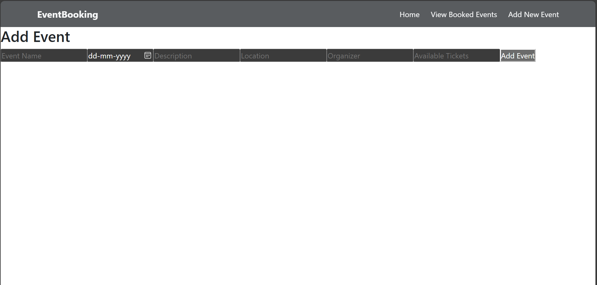
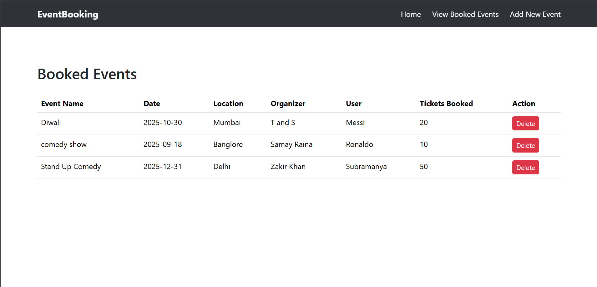

# Event Booking System
A **full-stack web application** for adding events, booking/deleting event tickets, and handling event details seamlessly.  
This project is built using **React** for the frontend, **Spring Boot** for the backend, and **MySQL** as the database.

---

## Features

-  **Event Management** – Create events, View events.
-  **Booking System** – Book/delete event tickets and track your bookings.
-  **RESTful APIs** – Clean and structured APIs for smooth communication.

---

## Tech Stack

### **Frontend**
- React.js
- React Router
- Axios

### **Backend**
- Spring Boot
- Spring Data JPA
- MySQL Connector

### **Database**
- MySQL

---

## Prerequisites

Make sure you have the following installed:

- [Node.js](https://nodejs.org/) (v18+ recommended)
- [Java JDK](https://www.oracle.com/java/technologies/javase-downloads.html) (17+ recommended)
- [Maven](https://maven.apache.org/) (for Spring Boot)
- [MySQL](https://dev.mysql.com/downloads/) (8.0+ recommended)
- [Git](https://git-scm.com/)

---

## Setup & Installation

###  **Clone the Repository**
```bash
git clone https://github.com/patilsubramanya/eventbooking.git
cd eventbooking
```
### **Setup the Backend**
```bash
cd eventbooking-backend
```
### Open src/main/resources/application.properties and configure your database:
```bash
spring.datasource.url=jdbc:mysql://localhost:3306/eventbooking
spring.datasource.username=<your-db-username>
spring.datasource.password=<your-db-password>
spring.jpa.hibernate.ddl-auto=update
spring.jpa.show-sql=true
```
### Build and run the Backend
```bash
mvn clean install
mvn spring-boot:run
```
#### Backend will start on: http://localhost:8080
### **Setup the Frontend**
```bash
cd ../eventbooking-frontend
```
### Install the dependencies
```bash
npm install
```
### Start the Frontend
```bash
npm start
```
#### Frontend will run on: http://localhost:3000

## Screenshots

### Home Page


### Add Event Page


### Booking Page

